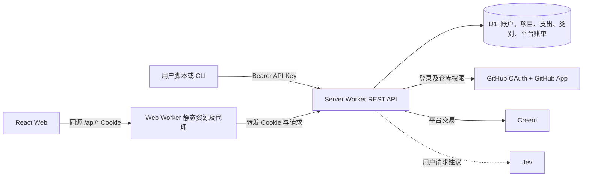

# Pullwise 转型设计：GitHub 项目支出记账

状态：设计稿，2026-09-27。本文描述目标产品和实施边界，不表示现有代码已经实现。本文中的“项目”指一个 GitHub repository，而非 GitHub Projects 看板。前端 `pullwise-web` 与后端 `pullwise-server` 仍为独立部署单元。

实施状态（2026-09-28）：S01–S16 的目标代码已在两端完成本地实现，S15 的旧 Server 运行时已删除；S12 长篇多语言文案已补齐。S17 的本地静态、合成数据库与 Web 测试持续记录在两端 `docs/handoffs/S17-*.md`；Python CSV 到 `ReadableStream` 的真实 workerd 验证仍未进行，因此不得将 S17 记为全部验收通过。S18 Cloudflare 预览、远程 D1 迁移及真实 GitHub/Creem/Jev 验收未执行，缺预览域名、D1 ID 与 Wrangler 凭证。下文“当前仓库事实与差距”保留设计时的 2026-09-27 基线，不代表今天的代码状态。

## 1. 产品目标与边界

用户沿用现有 GitHub 登录与 GitHub App 仓库授权，选择有权限的仓库，给每个仓库填写自己的项目描述，按发生日期和自定义类别记录支出。每条支出记录包含金额、货币、用途、类别、备注；可选数量和单位，用于表达工时、调用量等。用户可按项目、类别、日期查看明细和合计，也可**修改或移除已录入的支出记录**。

账户还有一个独立的**公共支出池**：例如一份供多个项目使用的 coding agent 订阅。公共支出只入公共池，不复制、不隐式摊入任何项目。项目报表只汇总该项目的支出；账户总览分别显示项目支出合计、公共池合计以及二者之和，避免重复计数。若将来需要分摊，应另做显式、可追溯的分摊功能，而不修改原始公共记录的归属。

现有 Creem 支付是用户购买 Pullwise 服务的**平台账单**，用户填写的项目支出是**业务记账数据**。两者必须使用不同表、API、导航和文案；平台支付不会自动成为项目支出。保留既有支付交易事实、订阅历史、Webhook 验签及幂等处理，产品套餐权益改为适合记账服务的项目数、记录数或 Jev 辅助次数，具体价格和限额须在实施前与运营配置对齐。核心手工记账和报表不依赖 Jev。

## 2. 当前仓库事实与差距

| 领域 | 当前证据 | 迁移判断 |
| --- | --- | --- |
| GitHub 身份和仓库授权 | Server `pullwise_server/_app_part_10_handler_main.py` 有 `/auth/github/*`、`/integrations/github/*`、`/repositories`；`github_auth.py` 和 `github_authorization.py` 承担 OAuth/App 逻辑 | 保留授权方式和安全约束；将必要处理移植到 Cloudflare Server Worker，而非重新设计登录 |
| Token | `db.py` 和 `cloudflare_api_key_*` 保存哈希化 API Key；当前作用域仍是 PR/CI/Updates 相关范围 | 复用一次展示、哈希存储、撤销与认证机制；替换为记账作用域并更新前后端与文档 |
| 支付 | 本地 Server 有 `/billing/*`、`/webhooks/creem`；Cloudflare 候选入口只有部分账单读取及 Creem Webhook | 保留支付事实与流程，并补齐 Cloudflare 上的购买、套餐变更、取消/恢复和可信目录刷新；不能把候选入口当成已可上线 |
| 旧核心 | `product_*`、部分 `github_*`、`cloudflare_*` 和 Web `dashboard.jsx`、`product-management.jsx`、`product.js` 面向 PR/CI/Updates | 用记账模型、API 和页面替换；按依赖核对后删除旧采集、分析、Job 与页面代码 |
| 部署 | Web 的 `wrangler.jsonc` + `worker.js` 已配置静态资源和 `/api/*` 代理，`package.json` 有 `deploy:workers`；Server `cloudflare/server/wrangler.jsonc` 是 `workers_dev:false`、无 routes、`remote:false` 的本地候选 | Web 保留同源代理；Server 增加可部署配置、D1 migrations、部署脚本及完整 HTTP 入口，当前配置不能直接当生产配置 |

`pullwise-web/README.md` 仍把 Server 描述为 VM/容器服务，而现目标要求两端都部署到 Cloudflare；实施时同步改 README、运行手册和 CI。旧 PR/CI/Updates 设计与状态文档已移除；`openapi/product-v1.yaml` 暂留作当前运行代码的契约，实施时替换，不继续作为新服务的产品定义。仓库目前有大量未提交改动，代码删除清单必须在实施时以当时工作树和引用关系复核，不允许按文件名前缀批量删除。

## 3. 目标架构

- Web 只调用 Server REST API；浏览器不持有 GitHub App 私钥、Creem 密钥、Jev 密钥或 API Key。沿用 `worker.js` 的同源代理与 `/api` 前缀剥离规则，Cookie 登录通过 `/api/auth/*`；脚本可直连 Server `/api/v1/*`，使用 `Authorization: Bearer pwk_…`。
- Server 负责认证、当前用户归属、GitHub 仓库资格、输入校验、D1 事务、金额汇总、平台支付和可选建议。所有记账读写在服务端校验 `owner_id`，不能信任客户端传来的 owner。
- 继续使用 GitHub 稳定 numeric repository ID 作为外部身份，仓库改名只更新展示名称，不改变项目关联。用户仅可为当前 GitHub App 授权可见的仓库创建/启用项目；仓库授权丢失时停止显示该项目受保护的 GitHub 元数据，也不允许新建指向该项目的支出。其账户所有者仍可查看、修改、移除和导出**自己录入的历史支出**，不因 GitHub 失权而失去个人账本控制权。该失权处理应有明确的恢复页面，不能把失权当成“项目金额为零”。
- D1 使用专门的关系表和索引，不把新增支出作为整个账户 JSON 快照读写。账单表与支出表物理隔离。对一个用户读/写一个资源时，在同一请求的授权检查与数据操作中维持一致快照/事务语义。

## 4. 数据模型和计算规则

| 表/对象 | 主要字段及约束 |
| --- | --- |
| `ledger_projects` | `id`, `owner_id`, `github_repo_id`, `github_full_name`, `description`, `status`, `revision`, timestamps；`UNIQUE(owner_id, github_repo_id)`；描述由用户维护，不覆盖 GitHub description |
| `expense_categories` | `id`, `owner_id`, `name`, `color?`, `archived_at`；同账户有效名称唯一；公共池和项目共用账户类别，避免同名类别拆散统计 |
| `expenses` | `id`, `owner_id`, `target_kind` (`project`/`shared`), `project_id`（共享时必须 NULL）, `category_id`, `occurred_on` (`YYYY-MM-DD`), `amount_minor`, `currency`, `purpose`, `note?`, `quantity_decimal?`, `unit?`, `revision`, timestamps, `deleted_at?`；数据库 CHECK 保证归属二选一 |
| `expense_events` | `expense_id`, `owner_id`, `actor_kind`, `actor_id`, `action`, `before_json`, `after_json`, `created_at`；记录金额/目标/类别修改与删除，以便对账 |
| 既有身份/平台账单 | 保留用户、Session、API Key、GitHub 安装授权、Creem 交易/订阅历史；只迁移与新权益有关的投影，不将 `processing_usage_ledger` 误用为支出账本 |

金额使用非负整数最小货币单位和 ISO 4217 货币代码；输入只接受明确的小数精度，后端按对应货币指数转为整数，拒绝浮点误差、超精度、溢出和负数。退款/冲销未来用独立关联的反向记录；首版不通过负金额模糊表达。`quantity_decimal` 用十进制字符串，`unit` 是用户自定义短文本（如 `hour`、`request`），不参与货币求和。项目描述、用途、备注和单位都按有限长度纯文本保存、转义显示。`occurred_on` 是用户填写的业务日期，不从创建时间或浏览器时区推断；时间范围采用含起始、不含结束的日期区间。创建/修改时间另存 UTC。

报表由后端从 `expenses` 的有效记录聚合：`GROUP BY target, currency, category_id` 或日期桶（日/月），用户可选择日期范围和类别。不同货币逐币展示，不直接相加或展示伪单一总额；换汇与汇率来源另列后续需求。空数据返回真实零记录/空分组，查询失败返回错误态。按 `owner_id, target_kind, project_id, occurred_on, category_id` 建索引，报表与分页列表共用过滤定义。共享池完全不进入 `project_id` 分组；账户总览先按项目、公共池分别聚合再合计，且仍逐币计算。

已录入记录允许其账户所有者修改目标（项目或公共池）、日期、金额、货币、类别、用途、备注、数量和单位。修改在一笔事务内更新记录与审计事件，成功响应后相关项目/公共池的明细及全部汇总按新值重算；从项目移到公共池时，原项目扣除、公共池增加，不能留两份。修改使用 `revision`/`If-Match` 乐观锁；创建使用 `Idempotency-Key`，避免重试重复入账。

“移除”是用户可执行的删除操作：确认后后端软删除并写审计事件，记录立即从正常明细、导出和所有报表中排除，且不再计入任何合计；重复删除不会再次改变金额。本人 API Key 仅在拥有 `expenses:write` 和对应目标权限时可以执行；移动记录时同时校验旧目标与新目标权限。软删除用于追溯误操作和并发修改，不应让被移除记录继续出现在日常账单页。若提供恢复入口，恢复也须版本校验与审计；彻底删除/数据保留遵循隐私政策。类别删除仅归档，已有有效支出继续保留其历史类别引用；跨账户引用、失效类别和**新指向**失权项目的写入均拒绝。API Key 撤销即时生效。

## 5. REST API 契约草案

所有业务路径以 `/api/v1` 开头；Web 使用 `/api/api/v1/...` 的同源代理路径时应由现有请求 helper 统一组装，避免手写双前缀。实现时以一份新的 OpenAPI 文件为准并生成/校验前端 client。以下路径为目标契约，不能把当前 `product-v1.yaml` 直接视为已覆盖。

| 方法与路径 | 作用 | 建议的 Key scope |
| --- | --- | --- |
| `GET /api/v1/me` | 当前身份、能力与记账权益 | `profile:read` |
| `GET /api/v1/repositories` | 当前可授权仓库的分页列表 | `projects:read` |
| `GET /api/v1/projects`、`GET /api/v1/projects/{id}` | 我的项目及描述、GitHub 状态、逐币总额摘要 | `projects:read` |
| `POST /api/v1/projects`、`PATCH /api/v1/projects/{id}` | 从已授权仓库创建项目、修改描述或归档；更新需 `If-Match` | `projects:write` |
| `GET/POST /api/v1/categories`、`PATCH/DELETE /api/v1/categories/{id}` | 自定义类别与归档 | `categories:read/write` |
| `GET/POST /api/v1/expenses`、`GET/PATCH/DELETE /api/v1/expenses/{id}` | 项目或公共池记录；PATCH 修改已记支出，DELETE 移除并从统计排除；列表支持 `target`, `projectId`, `categoryId`, `from`, `to`, `currency`, cursor、limit 过滤 | `expenses:read/write` |
| `GET /api/v1/expenses/export` | 按同一过滤语义导出本人支出，流式 CSV 并防止公式注入 | `expenses:read` |
| `GET /api/v1/reports/summary`、`GET /api/v1/reports/timeseries`、`GET /api/v1/reports/categories` | 项目/公共池/账户视图，逐币日期与类别统计；同一过滤语义 | `reports:read` |
| `POST /api/v1/expense-suggestions` | 可选 Jev 建议；不写账本 | `suggestions:use` |

创建支出示例：`{"target":{"kind":"shared"},"occurredOn":"2026-09-27","amount":"20.00","currency":"USD","categoryId":"cat_...","purpose":"Coding agent 月费","quantity":"1","unit":"month","note":"供多个仓库使用"}`；项目支出改为 `{"kind":"project","projectId":"prj_..."}`。响应回显 `amountMinor`、`currency`、`revision`、`createdAt`，不把平台支付事实混入。输入金额字符串由后端转换，列表和报表只返回精确整数或可确定的小数字符串。

Session Cookie 和 Bearer Key 共用业务授权与 DTO；登录/支付/API Key 管理仍仅允许 Cookie 的受保护入口。新 Key 默认只读，显式勾选写权限；可选项目 ID 限制必须在支出、报表和建议路径统一生效，公共池权限须单独标注，不能由“某项目可写”推导。`401` 表示未认证，`403` 表示作用域/资源不足，`404` 隐藏别人的资源，`409` 表示幂等冲突，`412` 表示版本冲突，`422` 表示字段错误。Cookie 写请求维持现有 Origin/CSRF 防护，所有私有响应 `Cache-Control: no-store`。限流按账户/Key 对写入、报表和 Jev 分别设置。

## 6. 前端体验

1. 首页、登录和引导：说明 GitHub 项目记账、公共支出池与独立平台支付；登录后展示已授权仓库，用户选择一个仓库并可填写项目描述。未授权/授权失效分别显示操作指引。
2. 项目总览：卡片或列表显示仓库名称、用户描述、选定区间的逐币支出；进入项目可查看日期趋势、类别分布、可筛选的支出表与新增/编辑表单。每条已记支出提供“修改”“移除”；移除需确认，成功后当前明细与各图表同步刷新，失败时保持原值并显示错误。
3. 公共支出池：在导航中与项目并列，使用相同记账表单和报表，但没有项目归属选择后的隐式复制。账户总览分开展示项目与公共池，跨项目 agent 账单只出现一次。
4. 类别管理：新增、改名、归档；表单可从账户类别选择。日期、用途、金额、货币、类别为必填；备注、数量、单位可选；支持明确的空态、校验错误和保存冲突提示。
5. 保留账户设置、API Key、平台账单、价格、法律和状态页，更新文案、导航、SEO、多语言与 API 文档。`Billing` 清楚标注为“Pullwise 订阅”，避免与项目“支出”混淆。Jev 建议显示候选类别/重复提示及“不确定”，由用户确认后才进入表单；失败时正常手工记账。

前端只通过 REST 读写，不在浏览器计算权威总额；图表可使用 API 返回的日期桶和类别汇总。页面缓存按账户、项目和过滤条件隔离，切换用户或失权时清除受保护数据。保留现有硬边界布局、响应式和可访问性习惯。

## 7. Jev 的实际作用

[TypeSafe 官方快速开始](https://docs.typesafe.ai/introduction/quickstart)描述 Jev 输入为 `state` 与类型化问题，输出为 Choice/Score/Noul 及概率；它适合候选分类和判断，不负责算术、权限或账本写入。先在 Server 的可选 `POST /expense-suggestions` 接入固定、可回滚的模型版本，例如当前已有适配代码使用的 `jev-1.13.0`。提供的数据仅限用户主动提交的用途/备注片段和其账户类别名称，不发送 GitHub Token、支付凭证或不相关仓库内容。

| 场景 | Jev 输入/问题 | 输出如何使用 |
| --- | --- | --- |
| 类别建议 | `purpose`、必要的备注、现有类别 ID/描述；Choice 含 `other/unknown` | 返回候选类别及概率；仅预选表单，用户确认后存储 |
| 公共池提示 | 用途描述和用户已选择的目标；Noul 问“这笔费用是否明显跨多个项目？” | 仅提示用户核对归属，不自动改为公共池或分摊 |
| 疑似重复 | 当前草稿与同账户、相近日期金额的有限候选记录；Choice/Score 判断相似度 | 提示可能重复的记录链接；精确去重仍靠 Idempotency-Key 和用户确认 |

类别 ID 必须由后端验证为该账户当前允许的类别；即使 Jev 高置信度也不能创建类别、入账、改金额、推断汇率或决定 GitHub/支付权限。服务端设请求大小、超时、费用/调用次数上限和故障降级；保存问题版本、模型版本、候选、概率与用户接受/改选结果，便于评估。先用中英文真实匿名样本标注准确率、误提示率和“不确定”覆盖率，再决定阈值；未通过评估时保持功能关闭。现有 `typesafe_client.py`、`product_analysis_*` 的 Jev 链路为旧 PR/CI/Updates 产品服务，不能直接当成记账接入；可复用其安全传输与 SDK 经验，但需隔离新的问题定义和调用预算。Cloudflare Python Worker 对目标 SDK/网络调用的生产适配需在完成实现后验证，必要时使用 Server Worker 内受控 HTTP 调用。服务端密钥使用 Cloudflare Secret。

## 8. 清理清单与实施顺序

先以新契约替换引用，再删除旧核心；每个路径都应在最终工作树中查引用、测试和构建结果。下列为基于当前文件的**候选**，不是现在执行的删除命令。

| 动作 | 文件/目录 | 注意点 |
| --- | --- | --- |
| 保留并改造 | Server `github_auth.py`、`github_authorization.py`、`github_credentials.py`、OAuth/安装回调、`api_key_dto_rules.py`、`cloudflare_api_key_*`、`billing.py`、`cloudflare_creem_handler.py`、账户/Session 相关模块 | 保持 GitHub 授权和支付事实；移除旧权益字段时保护付款历史与身份 |
| 新增 | Server `ledger_domain.py`、`ledger_store.py`/D1 adapter、`ledger_api.py`、新 OpenAPI、D1 migration、报表查询、可选 Jev suggestion adapter；Web `src/api/ledger.js`、项目/公共池/类别/报表页面 | 命名为建议，实施时按现有包结构拆分；REST 契约先行 |
| 替换后移除 | Server `product_domain.py`、`product_store.py`、`product_api.py`、`product_jobs.py`、`product_discovery.py`、`product_analysis_input.py`、`product_analysis_runner.py`、`product_projection.py`、`product_visualizations.py`、`product_source_events.py`、`product_item_filters.py`、`product_update_items.py`、`product_pr_comment_items.py` 等旧域代码；`cloudflare_source_read.py`、`cloudflare_item_read.py`、`cloudflare_item_handling.py`、`cloudflare_watch_adapter.py` 等旧 D1 映射 | 先核查 `product_*` 中是否承载账户/支付/仓库权限的可复用部分，再拆分；保留通用 GitHub 授权、目录和 HTTP 传输 |
| 替换后移除 | Server `github_pr_reader.py`、`github_pr_threads.py`、`github_pr_reviews.py`、`github_ci_reader.py`、`github_ci_logs.py`、`github_ci_transport.py`、`github_release_reader.py`、`github_ingestion.py` 等 PR/CI/Release 事实采集链路 | `github_auth.py`、`github_authorization.py`、`github_credentials.py`、必要的 App Webhook 和仓库目录能力不得随之删除 |
| 替换后移除 | Web `src/screens/dashboard.jsx`、`product-management.jsx` 中的旧 PR/CI/Updates 视图，`src/api/product.js`、旧产品组件/样式/测试、`src/screens/product-api-scopes.js` 的旧 scope | 可复用壳层、图表样式和通用 HTTP helper；测试改为记账契约 |
| 后续删除或替换 | `openapi/product-v1.yaml` 旧版本、`cloudflare/probe/` 中只服务旧分析的 probe、`launcher.sh`、`git-watch.sh`、旧 Worker/Agent/扫描脚本及 CI lane | 逐项核对后处理；保留用于新 Cloudflare 部署与安全回归的脚本/测试。旧 PR/CI/Updates、Worker 管理和 Cloudflare 事务设计文档已移除 |
| 同步更新 | 两端 `README.md`、`AGENTS.md` 当前产品段落、`.github/workflows/ci.yml`、Web `index.html`/`src/lib/seo.js`/法律页/多语言/Docs/API Docs、Server 部署说明 | 不得继续宣称 PR/CI/Updates 是对外服务；法律页描述记账数据、建议数据与保留规则 |

### 小阶段与交接规则

每次开发任务只完成下表**一个小阶段**。阶段边界以表中的可验收结果为准，不因代码已写一部分就宣称完成。完成本阶段的本地验证后，必须先在负责工程内写交接文档，再暂停本次开发任务；不得自动开始下一阶段。开发者阅读交接后，决定让同一 agent 继续，或把下一阶段交给其他 agent。若开发者明确指定不同顺序或合并阶段，以其最新指令为准，并在交接中记下变更。

| 阶段 | 工程 | 本阶段完成的可验收结果 |
| --- | --- | --- |
| S01 | Server | 新记账 OpenAPI 草案、D1 migration 布局、Server 生产/预览配置和受保护的部署脚本；仅本地静态/语法检查，不接入真实 Cloudflare |
| S02 | Web | 保留并核对静态资源 Worker 与 `/api/*` 代理，补齐新 API 路径和部署脚本/本地检查；本地构建通过，不执行 `deploy:workers` |
| S03 | Server | 现有 GitHub OAuth、App 仓库授权与 Session 接入 Server Worker；合成回调、失权和 Cookie 测试通过 |
| S04 | Server | 既有 Creem 购买/变更/取消/恢复及 Webhook 支付事实接入 Worker；本地重放和历史交易测试通过 |
| S05 | Server | API Key 换为记账 scope、项目/公共池限制和撤销规则；Cookie/Token 权限契约测试通过 |
| S06 | Server | 项目描述、GitHub 仓库绑定与类别 CRUD；D1 所有权/失权/并发测试通过 |
| S07 | Server | 项目与公共池支出创建、查询、修改、移除；金额精度、归属迁移、幂等与审计测试通过 |
| S08 | Server | 逐币日期/类别报表、分页与导出；Cookie/Token 共享 REST 契约及权限测试通过 |
| S09 | Web | 项目选择、描述、类别管理与失权历史数据页面；前端本地交互测试通过 |
| S10 | Web | 项目和公共池的新增、修改、移除支出流程；保存冲突、删除确认和错误/空态测试通过 |
| S11 | Web | 日期/类别图表、逐币账户总览和明细筛选；报表与列表同过滤条件测试通过 |
| S12 | Web | API Key 文档、平台账单区分及营销/法律/多语言文案；本地构建和页面测试通过 |
| S13 | Server | 可选 Jev 建议入口、开关、限额、失败降级及离线样本评估；关闭 Jev 时核心记账完整可用 |
| S14 | Web | Jev 类别/公共池/重复提示的确认界面；建议失败时手工表单仍可用 |
| S15 | Server | 删除无引用的 PR/CI/Updates 采集/分析/旧 API/脚本与旧 OpenAPI，保留身份和支付；Server 本地回归通过 |
| S16 | Web | 删除旧 PR/CI/Updates 页面、客户端、样式/测试和文案；Web 本地回归通过 |
| S17 | Server + Web | 完整本地联调、契约/权限/账目/支付/部署脚本检查；两个工程各写一份相互链接的交接文档，列清未做的远程验收 |
| S18 | Server + Web | **仅在 S17 证明全部目标功能已实现且开发者指示继续后**进行 Cloudflare 远程迁移、预览与验收；生产发布仍需审阅迁移、配置和回滚方案 |

交接文档放在当前阶段负责工程的 `docs/handoffs/Sxx-<简短名称>.md`（例如 `pullwise-server/docs/handoffs/S07-expenses.md`）；Web 阶段放在 `pullwise-web/docs/handoffs/`。跨工程阶段在两个工程各写一份并互相链接。这些是阶段执行记录，不是另一套产品设计。每份交接至少写清：阶段编号与完成/未完成状态、改动文件和契约/数据决策、运行过的本地检查及结果、尚存风险或阻塞、Cloudflare 真实测试是否未运行、下一阶段的具体入口。保留可复用规则到对应 `AGENTS.md`；不要把凭证、Token 或真实用户账目写进交接。交接文件写完并核对路径后，向开发者报告完成情况并**停止当前开发任务**，等待“继续”或新的 agent 接手指令。

部署脚本的接口在 S01/S02 就固定：Web 保留 `pullwise-web/package.json` 的 `build`、`deploy:workers` 与 `wrangler.jsonc`，增加本地配置检查；Server 新增 `cloudflare/server/wrangler.production.jsonc` 和 `scripts/deploy-cloudflare.sh`（实际名称可随仓库规范调整）。Server 脚本显式选择配置与 D1 绑定，先执行 `wrangler d1 migrations apply DB --remote --config ...`，再执行 `wrangler deploy --config ...`；默认只打印待执行步骤，必须传显式执行参数才会触发远程操作。脚本预检拒绝占位数据库 ID、缺失域名/环境名和未完成的本地检查；密钥只通过 Cloudflare Secret 配置，不写入 `wrangler.jsonc` 或命令日志。Web 的代理源 `PULLWISE_API_ORIGIN` 指向新 Server Worker 自定义域，GitHub OAuth 回调通过 Web `/api/auth/github/callback` 到 Server `/auth/github/callback`；实施时用本地测试确认可信重定向、`Set-Cookie` 域/SameSite 和代理的 `Authorization` 透传。现有 Web 部署命令本身会真正发布，因此在完成实现前只检查其配置和构建，**不运行**该命令。只有整个目标服务完成后，或用户主动要求时，才进行任何 Cloudflare 真实测试（包括远程 D1、远程 Wrangler、预览/生产 Worker、真实 GitHub/Creem/Jev 联调）。

## 9. 验收证据

- 仓库 A、仓库 B 与公共池分别记账；各自类别/日/月汇总正确，账户合计无重复；混合币种不相加。
- 项目描述仅影响该用户项目，GitHub 仓库更名仍关联原项目；授权撤销后不能新增指向该项目的支出或泄露 GitHub 元数据，账户所有者仍可修改/移除/导出自己已录入的历史支出。
- Cookie Web 和不同 scope 的 Bearer Key 对同一资源返回相同业务结果；跨账户访问、跨项目限制、已撤销 Key、伪造 Cookie 写请求均被拒绝。
- 创建重试、并发修改、类别归档、软删除、缺失字段、金额精度/溢出、空报表、分页边界均有本地验证。已录入支出可修改金额/日期/类别/归属，原汇总扣除且新汇总增加；移除后列表、导出和报表均不再包含该笔，重复移除不二次扣除。
- 现有支付事件重放不会重复更新平台账单；平台账单与用户支出 UI/API/数据库分离；Cloudflare Server 覆盖实际 OAuth 与支付入口。
- Jev 关闭、失败或不确定时可照常手工记账；建议不能自行落账；只有经过样本评估的辅助能力可以开启。
- 两个部署单元都有可审阅的 Cloudflare 配置和部署脚本；旧 PR/CI/Updates 对外页面与 API 不再提供，文案、OpenAPI、测试与目标服务一致；Cloudflare 真实测试遵守上述时机限制。

## 参考

- [TypeSafe 官方 Jev 快速开始](https://docs.typesafe.ai/introduction/quickstart)：类型化问题、API 请求与返回示例。
- [Cloudflare Workers 配置](https://developers.cloudflare.com/workers/wrangler/configuration/)及[静态资源](https://developers.cloudflare.com/workers/static-assets/)：两个 Worker 的配置入口。
- [Cloudflare D1 migration](https://developers.cloudflare.com/d1/reference/migrations/)及[本地开发](https://developers.cloudflare.com/d1/best-practices/local-development/)：区分本地与远程数据库操作。
- [Cloudflare Python Workers](https://developers.cloudflare.com/workers/languages/python/)：Server 当前 Python Worker 候选的目标运行环境。
