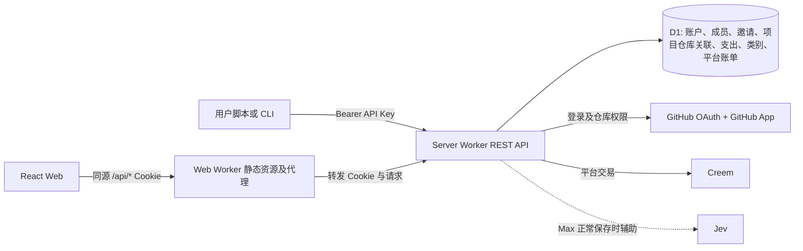

# Pullwise 转型设计：GitHub 项目支出记账

状态：当前产品设计，更新于 2026-10-06。本文描述产品契约和实施边界，运行验收状态见两端验证记录。本文中的“项目”是有稳定 project ID、显式关联 1–30 个 GitHub repositories 的记账项目；Organization 是可选关联，不是 GitHub Projects 看板。前端 `pullwise-web` 与后端 `pullwise-server` 仍为独立部署单元。

当前实施状态（2026-10-06）：多人账本、角色邀请、多仓库和 Organization 的 Server/Web 已实现、验证并发布 Preview，原数据库已在同一累计预算下升级到 v5。新角色通过真实本地 Worker 与模拟账号浏览器验证；本次线上访客验收不冒充双真实账号邀请测试。完整规则见[本版需求与迁移状态](../../planning/project-repositories.md)。原版本的验收已另行记录，不能作为本版权限或升级验收。

历史实施状态（2026-09-28）：当时原 S01–S16 已本地实现，S17 Worker/CSV 和 S18 Preview/提供商验收尚未完成。这是当时的阶段记录，当前证据以两端 `docs/validation/local-acceptance.md` 为准。

## 1. 产品目标与边界

用户沿用现有 GitHub 登录与 GitHub App 仓库授权，选择 1–30 个有权限的仓库建立项目，可填写项目名称、描述及 Organization 关联，按发生日期和自定义类别记录支出。每条支出记录包含金额、货币、用途、类别、备注；可选数量和单位，用于表达工时、调用量等。成员按所选账本的角色查看项目、类别、日期明细和合计，Owner/Admin/Editor 可**修改或移除已录入的支出记录**。

账本/workspace ID 沿用现有 `owner_id`。个人账本保留隐式 Owner；显式邀请 Admin/Editor/Viewer 后分享同一账本所有当前和未来财务数据，邀请创建与接受均提示此范围，不复制或重写历史。邀请绑定稳定 GitHub user ID、24 小时有效、token 只返回一次且只存 hash。GitHub Organization 成员资格不授予账本角色。Owner/Admin 管理项目与类别，Owner 管理 Admin，Admin 只管理 Editor/Viewer，Viewer 只读。账本配额、套餐与模型预算统一归 Owner；成员个人订阅和账本独立。

账户还有一个独立的**公共支出池**：例如一份供多个项目使用的 coding agent 订阅。公共支出只入公共池，不复制、不隐式摊入任何项目。项目报表只汇总该项目的支出；账户总览分别显示项目支出合计、公共池合计以及二者之和，避免重复计数。若将来需要分摊，应另做显式、可追溯的分摊功能，而不修改原始公共记录的归属。

现有 Creem 支付是用户购买 Pullwise 服务的**平台账单**，用户填写的项目支出是**业务记账数据**。两者必须使用不同表、API、导航和文案；平台支付不会自动成为项目支出。保留既有支付交易事实、订阅历史、Webhook 验签及幂等处理，产品套餐权益改为适合记账服务的项目数、记录数或 Jev 辅助次数，具体价格和限额须在实施前与运营配置对齐。核心手工记账和报表不依赖 Jev。

## 2. 当前实现入口

| 领域 | 当前入口 |
| --- | --- |
| Worker HTTP | `cloudflare/server/src/entry.py`；依赖源位于 `pullwise_server/` |
| 身份、账本与权限 | `cloudflare_github_identity_http.py`、`cloudflare_principal.py`、`cloudflare_ledger_auth.py`、`cloudflare_workspaces.py`、`cloudflare_api_key_*` |
| 项目、类别、支出 | `cloudflare_ledger_api.py`、`cloudflare_ledger_expenses.py` |
| 仓库关联 | `cloudflare_project_repositories.py`、`cloudflare_ledger_api.py`；实际操作成员 GitHub 授权 |
| 报表与导出 | `cloudflare_ledger_reports.py`；CSV 每页 250 条，Preview 在预算 ticket 内完成物化 |
| 平台支付 | `cloudflare_billing_*`、`cloudflare_creem_*`、`cloudflare_account_adapter.py`；支付事实与支出分离 |
| 可选建议 | `cloudflare_ledger_suggestions.py`、`cloudflare_jev_gateway.py`、`typesafe_client.py`；默认关闭 |
| Web | `src/api/ledger.js`、`src/screens/ledger.jsx`、账户/支付页面及 `worker.js` 同源代理 |

## 3. 目标架构

- Web 只调用 Server REST API；浏览器不持有 GitHub App 私钥、Creem 密钥、Jev 密钥或 API Key。沿用 `worker.js` 的同源代理与 `/api` 前缀剥离规则，Cookie 登录通过 `/api/auth/*`；脚本可直连 Server `/api/v1/*`，使用 `Authorization: Bearer pwk_…`。
- Server 负责认证、workspace 成员角色、GitHub 仓库资格、输入校验、D1 事务、金额汇总、平台支付和可选建议。所有记账读写在服务端校验所选账本 `owner_id` 和真实 actor 的当前凭证及 membership revision，不能信任客户端传来的 owner。Cookie 默认个人账本，可用 `X-Pullwise-Workspace` 显式选择；账本共享不改变平台账单的个人身份。
- GitHub 稳定 numeric repository/Organization ID 是外部身份；更名只影响展示。创建和关联变更逐仓库校验实际 actor 的 App user token，不能借用 Owner 凭证。每个仓库在同一账本最多关联一个项目，包括已归档项目；发现列表返回 `isBound`。部分失权时隐藏该仓库受保护的 GitHub 详情，历史财务记录按账本角色仍可使用；新增或移入项目目标须项目未归档且至少一个关联仓库当前对 actor 授权。未知授权结果失败关闭，不能当作“项目金额为零”。
- D1 使用专门的关系表和索引，不把新增支出作为整个账户 JSON 快照读写。账单表与支出表物理隔离。对一个用户读/写一个资源时，在同一请求的授权检查与数据操作中维持一致快照/事务语义。

## 4. 数据模型和计算规则

| 表/对象 | 主要字段及约束 |
| --- | --- |
| `ledger_projects` | 保留 `id`, `owner_id`, 原 `github_repo_id`/`github_full_name` 兼容字段、`description`, `status`, `revision`, timestamps；0005 追加可选 `name` 与 `github_organization_id`；描述由用户维护，不覆盖 GitHub description |
| `ledger_project_repositories` | `owner_id`, `project_id`, `github_repo_id`, GitHub 展示快照及 installation/account 元数据；`PRIMARY KEY(project_id, github_repo_id)`、`UNIQUE(owner_id, github_repo_id)`；同一项目 1–30 个显式关联 |
| `workspace_members` | `workspace_id`, `user_id`, `role` (`admin`/`editor`/`viewer`), `revision`, 加入/更新/移除时间；`PRIMARY KEY(workspace_id, user_id)`；Owner 为隐式身份 |
| `workspace_invites` / `workspace_events` | 固定接收人的 GitHub ID、邀请 hash、角色、期限、状态、revision 与邀请者权限版本；成员/邀请审计记录 workspace 和真实操作成员 |
| `expense_categories` | `id`, `owner_id`, `name`, `color?`, `archived_at`；同账户有效名称唯一；公共池和项目共用账户类别，避免同名类别拆散统计 |
| `expenses` | `id`, `owner_id`, `target_kind` (`project`/`shared`), `project_id`（共享时必须 NULL）, `category_id`, `occurred_on` (`YYYY-MM-DD`), `amount_minor`, `currency`, `purpose`, `note?`, `quantity_decimal?`, `unit?`, `revision`, timestamps, `deleted_at?`；数据库 CHECK 保证归属二选一 |
| `expense_events` | `expense_id`, `owner_id`, `actor_kind`, `actor_id`, `action`, `before_json`, `after_json`, `created_at`；记录金额/目标/类别修改与删除，以便对账 |
| 既有身份/平台账单 | 保留用户、Session、API Key、GitHub 安装授权、Creem 交易/订阅历史；只迁移与新权益有关的投影，不将 `processing_usage_ledger` 误用为支出账本 |

金额使用非负整数最小货币单位和 ISO 4217 货币代码；输入只接受明确的小数精度，后端按对应货币指数转为整数，拒绝浮点误差、超精度、溢出和负数。退款/冲销未来用独立关联的反向记录；首版不通过负金额模糊表达。`quantity_decimal` 用十进制字符串，`unit` 是用户自定义短文本（如 `hour`、`request`），不参与货币求和。项目描述、用途、备注和单位都按有限长度纯文本保存、转义显示。`occurred_on` 是用户填写的业务日期，不从创建时间或浏览器时区推断；时间范围采用含起始、不含结束的日期区间。创建/修改时间另存 UTC。

报表由后端从 `expenses` 的有效记录聚合：`GROUP BY target, currency, category_id` 或日期桶（日/月），用户可选择日期范围和类别。不同货币逐币展示，不直接相加或展示伪单一总额；换汇与汇率来源另列后续需求。空数据返回真实零记录/空分组，查询失败返回错误态。按 `owner_id, target_kind, project_id, occurred_on, category_id` 建索引，报表与分页列表共用过滤定义。共享池完全不进入 `project_id` 分组；账户总览先按项目、公共池分别聚合再合计，且仍逐币计算。

已录入记录允许该账本 Owner/Admin/Editor 在相应凭证范围内修改目标（项目或公共池）、日期、金额、货币、类别、用途、备注、数量和单位。修改在一笔事务内复核身份/成员版本、更新记录与真实 actor 审计事件，成功响应后相关项目/公共池的明细及全部汇总按新值重算；从项目移到公共池时，原项目扣除、公共池增加，不能留两份。修改使用 `revision`/`If-Match` 乐观锁；创建使用 `Idempotency-Key`，成员的幂等身份分开，避免重试重复入账。多仓库关联不参与金额汇总，也不复制支出。

“移除”是用户可执行的删除操作：确认后后端软删除并写审计事件，记录立即从正常明细、导出和所有报表中排除，且不再计入任何合计；重复删除不会再次改变金额。本人 API Key 仅在拥有 `expenses:write` 和对应目标权限时可以执行；移动记录时同时校验旧目标与新目标权限。软删除用于追溯误操作和并发修改，不应让被移除记录继续出现在日常账单页。若提供恢复入口，恢复也须版本校验与审计；彻底删除/数据保留遵循隐私政策。类别删除仅归档，已有有效支出继续保留其历史类别引用；跨账户引用、失效类别和**新指向**失权项目的写入均拒绝。API Key 撤销即时生效。

## 5. REST API 契约

所有业务路径以 `/api/v1` 开头；Web 使用 `/api/api/v1/...` 的同源代理路径时应由现有请求 helper 统一组装，避免手写双前缀。实现时以一份新的 OpenAPI 文件为准并生成/校验前端 client。实际契约以 `openapi/ledger-v1.yaml` 为准。

| 方法与路径 | 作用 | 建议的 Key scope |
| --- | --- | --- |
| `GET /api/v1/me` | 实际 actor、所选 workspace/role/revision、有效能力与账本 Owner 权益 | `profile:read` |
| `GET /api/v1/workspaces` | 个人及已加入的账本 | Cookie Session |
| `GET /api/v1/workspaces/{workspaceId}/members`，成员 `PATCH/DELETE /{userId}` | 查看成员，按角色管理与 `If-Match` 版本调整/移除 | Cookie Session |
| `GET/POST /api/v1/workspaces/{workspaceId}/invites`，`DELETE /{inviteId}` | 创建 24 小时邀请、查看待接受邀请、按版本撤销 | Cookie Session |
| `POST /api/v1/workspace-invitations/preview`、`/accept` | 固定接收人预览/单次接受，body 为 token | Cookie Session |
| `GET /api/v1/repositories` | 当前可授权仓库的分页列表 | `projects:read` |
| `GET /api/v1/projects`、`GET /api/v1/projects/{id}` | 我的项目及描述、GitHub 状态、逐币总额摘要 | `projects:read` |
| `POST /api/v1/projects`、`PATCH /api/v1/projects/{id}` | `githubRepoIds` 显式多仓库创建/关联；可选 `name`、`description`、`githubOrganizationId`，修改或归档需 `If-Match` | `projects:write`，且 Owner/Admin |
| `GET/POST /api/v1/categories`、`PATCH/DELETE /api/v1/categories/{id}` | 自定义类别与归档 | `categories:read/write` |
| `GET/POST /api/v1/expenses`、`GET/PATCH/DELETE /api/v1/expenses/{id}` | 项目或公共池记录；PATCH 修改已记支出，DELETE 移除并从统计排除；列表支持 `target`, `projectId`, `categoryId`, `from`, `to`, `currency`, cursor、limit 过滤 | `expenses:read/write` |
| `GET /api/v1/expenses/export` | 按同一过滤语义导出所选账本许可的支出，流式 CSV 并防止公式注入；原生下载用 `workspaceId` query | `expenses:read` |
| `GET /api/v1/reports/summary`、`GET /api/v1/reports/timeseries`、`GET /api/v1/reports/categories` | 项目/公共池/账户视图，逐币日期与类别统计；同一过滤语义 | `reports:read` |
| `POST /api/v1/expense-suggestions` | 可选 Jev 建议；不写账本 | `suggestions:use` |

创建支出示例：`{"target":{"kind":"shared"},"occurredOn":"2026-09-27","amount":"20.00","currency":"USD","categoryId":"cat_...","purpose":"Coding agent 月费","quantity":"1","unit":"month","note":"供多个仓库使用"}`；项目支出改为 `{"kind":"project","projectId":"prj_..."}`。响应回显 `amountMinor`、`currency`、`revision`、`createdAt`，不把平台支付事实混入。输入金额字符串由后端转换，列表和报表只返回精确整数或可确定的小数字符串。

Session Cookie 和 Bearer Key 共用业务授权与 DTO；登录/支付/API Key 管理仍仅允许 Cookie 的受保护入口。新 Key 默认只读，显式勾选写权限；可选项目 ID 限制必须在支出、报表和建议路径统一生效，公共池权限须单独标注，不能由“某项目可写”推导。`401` 表示未认证，`403` 表示作用域/资源不足，`404` 隐藏别人的资源，`409` 表示幂等冲突，`412` 表示版本冲突，`422` 表示字段错误。Cookie 写请求维持现有 Origin/CSRF 防护，所有私有响应 `Cache-Control: no-store`。限流按账户/Key 对写入、报表和 Jev 分别设置。

workspace-scoped Key 绑定 `workspaceId` 与当前 `workspaceMemberRevision`；无 workspace 的旧 Key 保持个人账本默认值。有效权限是 Key scopes、当前角色、项目范围和 Shared Pool 许可的交集。workspace header 不能重选已绑定 Key 的账本；成员角色变更、移除或重加入后旧团队 Key 失效。撤销自己的 Key、移除成员及撤销邀请不受商业写入额度耗尽阻碍，但仍通过权限、版本和全局 D1 预算。CSV header/query 的 workspace 选择冲突会被拒绝。

## 6. 前端体验

1. 首页、登录和引导：说明 GitHub 项目记账、公共支出池与独立平台支付；登录后可切换个人/已加入账本。Owner/Admin 从实际 actor 的已授权仓库中多选 1–30 个，可填写项目名称、描述和 Organization 关联。未授权/授权失效分别显示操作指引。
2. 项目总览：卡片或列表显示仓库名称、用户描述、选定区间的逐币支出；进入项目可查看日期趋势、类别分布、可筛选的支出表与新增/编辑表单。每条已记支出提供“修改”“移除”；移除需确认，成功后当前明细与各图表同步刷新，失败时保持原值并显示错误。
3. 公共支出池：在导航中与项目并列，使用相同记账表单和报表，但没有项目归属选择后的隐式复制。账户总览分开展示项目与公共池，跨项目 agent 账单只出现一次。
4. 类别管理：新增、改名、归档；表单可从账户类别选择。日期、用途、金额、货币为必填；Free/Pro 和编辑操作须指定类别，Max 新增可由后台可靠分类；备注、数量、单位可选；支持明确的空态、校验错误和保存冲突提示。
5. 保留账户设置、API Key、平台账单、价格、法律和状态页，更新文案、导航、SEO、多语言与 API 文档。`Billing` 清楚标注为“Pullwise 订阅”，避免与项目“支出”混淆。Max 正常保存时自动享受 Jev 辅助，界面没有触发模型的功能按钮；分类不可靠时保留草稿并要求手工选择，重复与归属提示不阻挡保存。
6. 成员页面提供邀请、预览/接受、角色调整、移除和撤销；Owner/Admin 操作范围与服务端一致。分享前明确提示全部当前与未来账目会按角色可见。项目设置提供版本化仓库关联/Organization 编辑；绑定失权不遮蔽可读历史财务数据。

前端只通过 REST 读写，不在浏览器计算权威总额；图表可使用 API 返回的日期桶和类别汇总。页面缓存按身份、workspace、membership revision、项目和过滤条件隔离，切换账本或失权时清除受保护数据、草稿及一次性凭证，取消旧请求并忽略迟到结果。保留现有硬边界布局、响应式和可访问性习惯。

## 7. Jev 的实际作用

[TypeSafe 官方文档](https://docs.typesafe.ai/introduction)描述 Jev 输入为 `state` 与类型化问题，输出为 Choice/Score/Noul 及概率；它适合分类和判断，不负责算术或权限。Max 的普通 `POST/PATCH /api/v1/expenses` 已接入固定版本 `jev-1.13.0`，网页与 `expenses:write` API Key 共享实现，无须另加模型功能按钮或权限。模型收到的数据仅限本次提交的用途/备注和账户类别名称，不发送 GitHub Token、支付凭证或仓库代码。

| 场景 | Jev 输入/问题 | 输出如何使用 |
| --- | --- | --- |
| 自动分类 | `purpose`、备注、现有类别 ID/名称；Choice 含 `uncertain` | Max 新增未填类别时，只采用置信度至少 0.80 的有效类别；不确定则保留草稿要求手工选择，已填类别保持原值 |
| 归属提示 | 用途/备注；Choice 判断项目专用、公共或不确定 | 返回建议供核对，不自动移动、复制或分摊支出 |
| 疑似重复 | 同账户、同目标、同币种金额、前后七日内最多 30 条记录；本地精确用途匹配 | 普通保存响应提示记录 ID，不阻挡保存，不将历史记录发送给模型；幂等重放仍由 Idempotency-Key 精确保证 |

类别 ID 必须由后端验证为该账户当前允许的类别；即使 Jev 高置信度也不能自行发起记账、创建类别、改金额、推断汇率或决定 GitHub/支付权限。用户正常保存时，后端将可靠类别与授权、版本、幂等和审计校验一起提交。服务端设请求大小、超时、费用/调用次数上限和故障降级，并保存问题版本、模型版本、概率与结果；高级建议接口另可记录接受/改选。先用标注后的中英文样本测量真实模型的准确率、误提示率和“不确定”覆盖率，再决定阈值；未通过评估时保持功能关闭。用户于 2026-10-02 授权本次预览评估使用自编测试样本，结果须明确标为合成数据验证，不能宣称已通过客户数据验收。建议问题和调用预算由 `cloudflare_ledger_suggestions.py` 定义；`typesafe_client.py` 验证固定模型、输入与响应，`cloudflare_jev_gateway.py` 提供固定端点的 Worker HTTP 传输。真实运行时验证仍须通过。服务端密钥使用 Cloudflare Secret。

## 8. 验证与发布门槛

当前（2026-10-06）：本版实现已在本地完成，最终 Server/Web 检查及 Preview 发布验收仍待记录。验证需覆盖 workspace 隔离、角色拒绝、固定身份邀请的过期/撤销/复用、权限 revision、Key 范围、成员真实审计、Owner 统一配额、多仓库并发关联和历史报表金额不变。原版本证据有自己的日期与范围，不能证明这些新路径。

两端各维护一份 `docs/validation/local-acceptance.md` 并互相链接，记录当前检查和剩余门槛；已完成阶段的临时交接不作为现行规则保留。

0005 只追加四张成员/邀请/审计/仓库关联表及两列，并回填原单仓库映射；owner ID、project ID 和 expense/history 不重写。新 canonical schema 为五个 migrations、18 表/33 SQLite indexes。已存在 Preview 的精确 legacy-v4 一次性编译、原子升级已通过部署验收，沿用原 journal/namespace/database 并保留全部累计计数和证据；不重置、重试或添加 cron。最新用户要求正常可用的 Preview，因此普通产品流量不再受历史累计 100,000-read / 1,000-write 测试上限限制；有限验证计划保留原上限，每个产品 SQL batch 仍需边界预留和实际原生计量，商业配额和权限维持生效。详见 `docs/validation/d1-validation-budget.md` 当前策略。

当前授权允许本地修复/检查、main 推送及 Preview 发布与有限远程验收；最终结果须补充到验证记录。Server/Web 环境配置及数据库保持隔离，生产 `PULLWISE_D1_ACCESS_ENABLED=0`，本轮远程验证仅限 Preview。部署脚本不执行远程 migration；发布代码、迁移成功和业务验收必须分别记录。

历史门槛（2026-09-28）：当时原 S17/S18 尚未完成，Wrangler/workerd/D1（含本地探针）暂停，需要审阅边界及明确授权后继续。该暂停由后续明确授权取代；保留当时的验证记录而不将它用作当前发布规则。

## 9. 验收证据

- 一个项目关联仓库 A、B，另一个项目及公共池分别记账；各自类别/日/月汇总正确，账本合计无重复；关联变更不影响历史金额，混合币种不相加。
- 项目名称/描述和 Organization 关联按账本管理，GitHub 更名仍关联原稳定 ID；逐成员隐藏失权 GitHub 元数据，新项目目标须至少一个关联仓库获授权，历史财务记录仍按角色可修改/移除/导出。
- Owner/Admin/Editor/Viewer 与个人/其他团队账本隔离；固定 GitHub 身份邀请过期、撤销、复用和 inviter 失权均拒绝；成员变更立即影响 Cookie 与 Key，旧 membership revision 的 Key 不因重加入恢复。
- Cookie Web 和不同 scope 的 Bearer Key 对同一资源返回相同业务结果；跨账户访问、跨项目限制、已撤销 Key、伪造 Cookie 写请求均被拒绝。
- 创建重试、并发修改、类别归档、软删除、缺失字段、金额精度/溢出、空报表、分页边界均有本地验证。已录入支出可修改金额/日期/类别/归属，原汇总扣除且新汇总增加；移除后列表、导出和报表均不再包含该笔，重复移除不二次扣除。
- 现有支付事件重放不会重复更新平台账单；平台账单与用户支出 UI/API/数据库分离；Cloudflare Server 覆盖实际 OAuth 与支付入口。
- Jev 关闭、失败或不确定时可照常手工记账；建议不能自行落账；只有经过样本评估的辅助能力可以开启。
- 两个部署单元都有可审阅的 Cloudflare 配置和部署脚本；旧 PR/CI/Updates 对外页面与 API 不再提供，文案、OpenAPI、测试与目标服务一致；Cloudflare 真实测试遵守上述时机限制。

## 参考

- [TypeSafe 官方 Jev 快速开始](https://docs.typesafe.ai/introduction/quickstart)：类型化问题、API 请求与返回示例。
- [Cloudflare Workers 配置](https://developers.cloudflare.com/workers/wrangler/configuration/)及[静态资源](https://developers.cloudflare.com/workers/static-assets/)：两个 Worker 的配置入口。
- [Cloudflare D1 migration](https://developers.cloudflare.com/d1/reference/migrations/)及[本地开发](https://developers.cloudflare.com/d1/best-practices/local-development/)：区分本地与远程数据库操作。
- [Cloudflare Python Workers](https://developers.cloudflare.com/workers/languages/python/)：Server 当前 Python Worker 候选的目标运行环境。
